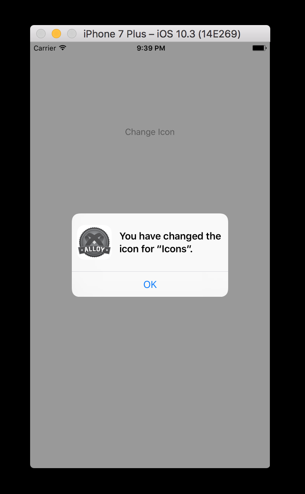
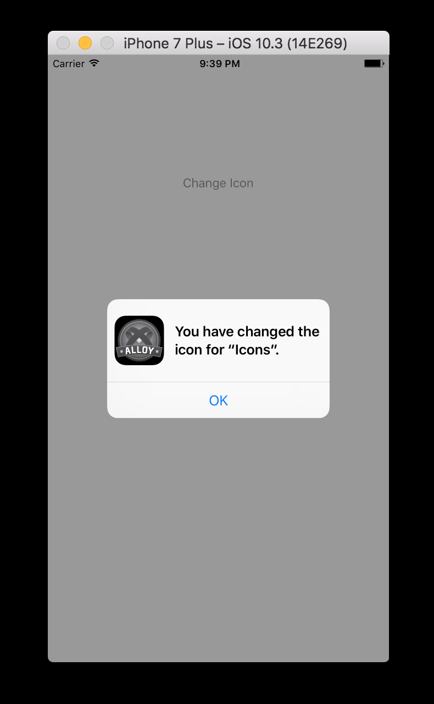

## Alternate App Icon Ti Module (iOS 10.3+)

### Summary

Leverage the ability to change the app icon in iOS 10.3+



### Requirements

  - Titanium Mobile SDK 6.0.3.GA or later
  - iOS 10.3 or later
  - Xcode 8.3 or later

### Download

  * [Stable release](https://github.com/ccavazos/titanium-alternate-icons/releases)

### Setup

Unzip the module in the `modules/iphone/` folder of your project.
Add the module requirement in your `tiapp.xml` file.

```xml
<modules>
    <module platform="iphone">ti.alternateicons</module>
</modules>
```

In order to use this module with Titanium you will need to disable app thinning by editing the adding the following property in your `tiapp.xml`

```xml
<ios>
    <use-app-thinning>false</use-app-thinning>
</ios>
```

Next, you have to declare the icons that you will use in your by adding the following to the `tiapp.xml`. The `<key>` named `alloyIcon` is the string that you will use to call the `set​Alternate​Icon​Name` method .

```xml
<ios>
	<key>CFBundleIcons</key>
	<dict>
		<key>CFBundleAlternateIcons</key>
		<dict>
			<key>alloyIcon</key>
			<dict>
				<key>CFBundleIconFiles</key>
				<array>
					<string>alloy</string>
				</array>
			</dict>
		</dict>
		<key>CFBundlePrimaryIcon</key>
		<dict>
			<key>CFBundleIconFiles</key>
			<array>
				<string>AppIcon</string>
			</array>
		</dict>
	</dict>
</dict>
</ios>
```

Copy your icons into the `app/assets/` folder. You can try it out with `alloy@2x.png` and `alloy@3x.png` in the example folder of this repo.

### Hyperloop

This module is also built in Hyperloop to demonstrate the native API access with JavaScript.
You can simple require the `ti.alternateicon.js` in your application and run it!

#### Example

Request a new review dialog:

```javascript
var AlternateIcon = require('ti.alternateicon');

if (AlternateIcon.isSupported()) {
  AlternateIcon.set​Alternate​Icon​Name('alloyIcon');
}
```
#### Methods

- [x] `isSupported`
- [x] `supportsAlternateIcons`
- [x] `alternateIconName`
- [x] `set​Alternate​Icon​Name`
- [x] `setDefaultIconName`

### Author

Cesar Cavazos ([@cesarcvz](https://twitter.com/cesarcvz) / [Web](http://ccavazos.co))

### License

Apache 2.0

### Contributing

Code contributions are greatly appreciated, please submit a new [pull request](https://github.com/ccavazos/titanium-alternate-icons/pull/new/master)

### Special Thanks

To [Hans Knoechel](https://github.com/hansemannn) because this module was created using [titanium-review-dialog](https://github.com/hansemannn/titanium-review-dialog) as a reference